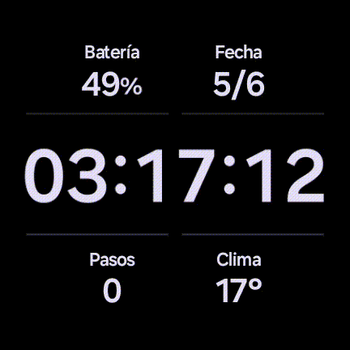
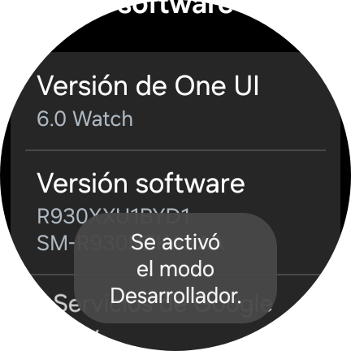
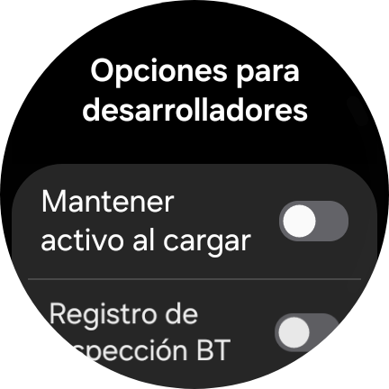
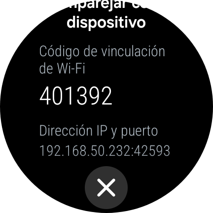
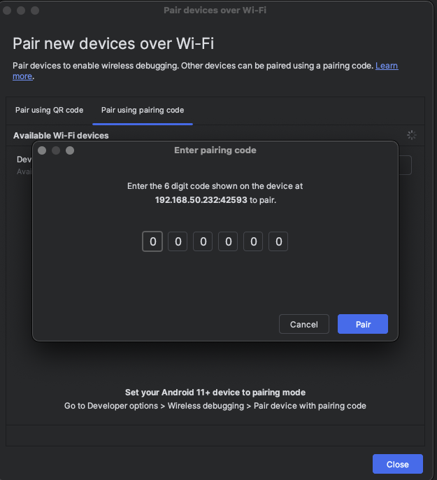
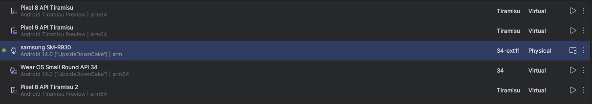

# InspQuotes - App de Citas para Wear OS

`InspQuotes` es una aplicación sencilla para Wear OS que muestra citas inspiradoras obtenidas desde una API en línea.

## 🖼️ Capturas de la Aplicación

<!-- *(Aquí puedes insertar una captura de pantalla de la aplicación en funcionamiento)* un .gif en images-->


`[ALT-TEXT: Captura de pantalla de la app InspQuotes mostrando una cita]`

## 📜 Descripción

Esta aplicación está diseñada para ofrecer a los usuarios una dosis diaria de inspiración directamente en su muñeca. Utiliza una interfaz de usuario limpia y minimalista, desarrollada con Jetpack Compose para Wear OS.

## ✨ Características

* **Citas Inspiradoras:** Muestra citas aleatorias para motivar al usuario.
* **Interfaz Moderna:** Creada con Jetpack Compose, optimizada para dispositivos Wear OS.
* **Consumo de API:** Obtiene las citas de una API externa utilizando Ktor Client.
* **Navegación Sencilla:** Una única pantalla para una experiencia de usuario directa.

## 📂 Estructura del Proyecto

El proyecto está organizado de la siguiente manera:
```bash
InspQuotes/
└── app/
    ├── src/main/
    │   ├── java/com/example/inspquotes/
    │   │   └── presentation/
    │   │       ├── MainActivity.kt       # Actividad principal y punto de entrada
    │   │       ├── QuoteScreen.kt        # UI principal de la app
    │   │       └── theme/                # Archivos de tema de Compose
    │   └── res/                          # Recursos (imágenes, strings, etc.)
    ├── build.gradle.kts                  # Dependencias y configuración de la app
    └── AndroidManifest.xml               # Manifiesto de la aplicación
```

## 🛠️ Modo Desarrollador y Conexión con Android Studio

Para compilar y ejecutar esta aplicación en tu wearable, primero debes habilitar las opciones de desarrollador y conectar tu dispositivo a Android Studio.

### 1. Activar el Modo Desarrollador en tu Wearable

1. Abre **Ajustes** en tu reloj.
2. Navega a **Sistema** >  **Información** .
3. Encuentra y pulsa repetidamente sobre el **Número de compilación** (usualmente 7 veces) hasta que aparezca el mensaje "¡Ahora eres un desarrollador!".
   
   `[ALT-TEXT: Imagen de la pantalla 'Información' en Wear OS, destacando el número de compilación]`
4. Vuelve al menú principal de Ajustes. Ahora verás una nueva opción llamada  **Opciones para desarrolladores** .

   `[ALT-TEXT: Imagen del menú de Ajustes en Wear OS con las Opciones para desarrolladores visibles]`

### 2. Conectar tu Wearable a Android Studio por Wi-Fi

1. Asegúrate de que tu ordenador y tu reloj estén conectados a la  **misma red Wi-Fi** .
2. En tu reloj, ve a **Ajustes** >  **Opciones para desarrolladores** .
3. Activa la  **Depuración por Wi-Fi** .
    
    `[ALT-TEXT: Imagen de la pantalla de opciones para desarrolladores en Wear OS, con la opción 'Depuración por Wi-Fi' activada]`
4. Selecciona  **Vincular nuevo dispositivo** . Aparecerá un código de vinculación en la pantalla.  
    
   `[ALT-TEXT: Imagen de un reloj Wear OS mostrando el código de vinculación para la depuración por Wi-Fi]`
5. En Android Studio, ve al menú de selección de dispositivos (junto al botón de "Run") y elige  **Pair Devices Using Wi-Fi** .

   `[ALT-TEXT: Captura de pantalla del menú de dispositivos en Android Studio, con la opción 'Pair Devices Using Wi-Fi' resaltada]`
6. Se abrirá una ventana emergente. Selecciona  **Vincular mediante código de vinculación** .
7. Introduce el código que se muestra en tu reloj y haz clic en  **Pair** .

   `[ALT-TEXT: Captura de pantalla de la ventana emergente en Android Studio para introducir el código de vinculación]`

Una vez completados estos pasos, tu wearable aparecerá en la lista de dispositivos de Android Studio, y podrás instalar y depurar la aplicación `InspQuotes` directamente en él.
